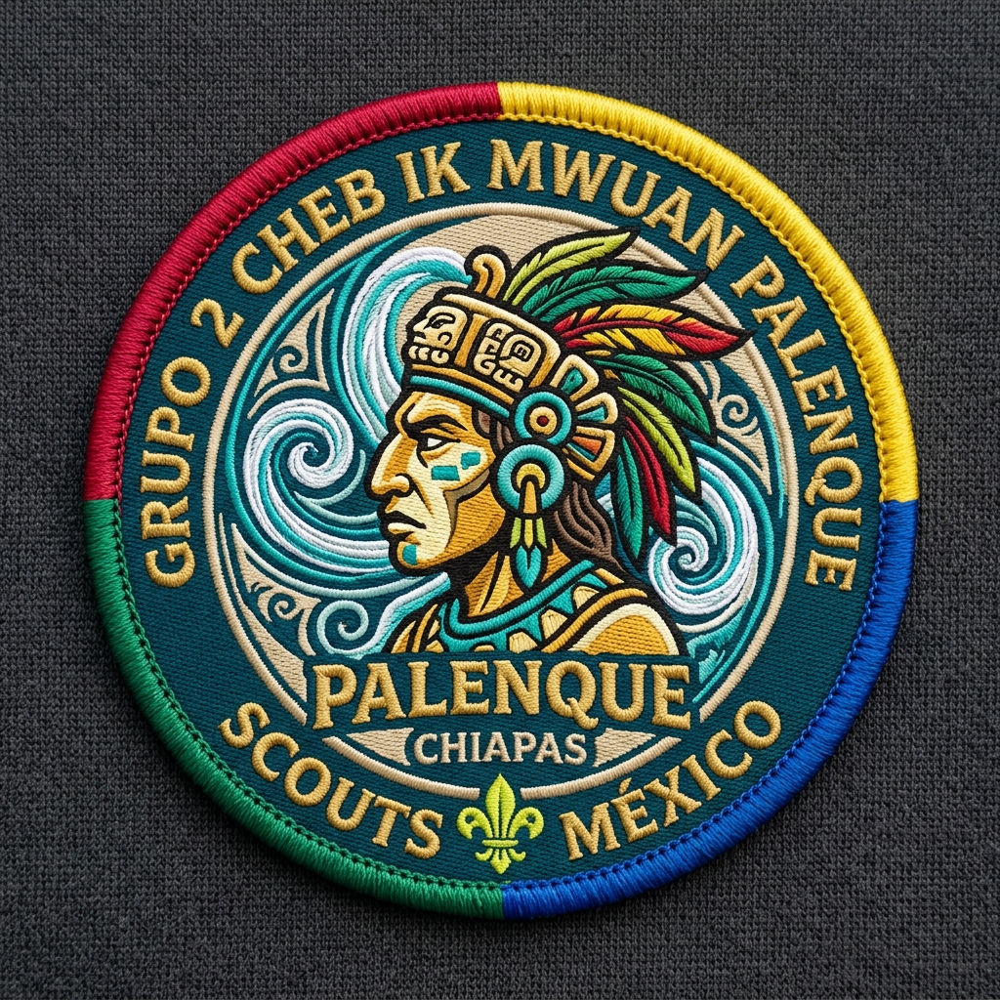

# Grupo 2 Cheb Ik Mwuan · Palenque, Chiapas 🌿⚜️

Sitio web oficial del **Grupo 2 Palenque (Grupo 2 Cheb Ik Mwuan)**, perteneciente a la **Asociación Nacional de Scouts Independientes, A.C. (ANSI)** y sede del **Clan Kawil**.



---

## 🧭 Identidad y Pañoleta Cuatricolor
Nuestra pañoleta porta con orgullo cuatro colores representativos:
- 🔴 **Rojo:** Coraje, determinación y el temple del guerrero maya.
- 🟡 **Amarillo:** Sabiduría solar maya de Palenque y la calidez fraterna scout.
- 🔵 **Azul:** Las aguas sagradas de Catazajá y ríos del Usumacinta; lealtad a la promesa.
- 🟢 **Verde:** La selva chiapaneca, la esperanza y la conservación activa de la naturaleza.

---

## ⚡ Clan Kawil (Roverismo)
El **Clan Kawil** es la rama mayor del Grupo 2, encargada del liderazgo logístico, servicio comunitario y expediciones de impacto. 
*Lema:* *"Remar la propia canoa sirviendo al hermano maya"*.

---

## 📅 Bitácora de Actividades y Eventos
- **Diciembre 2025:** Campamento de sierra en conjunto con el **Grupo 1** y servicio comunitario en **Oocotal, Veracruz**.
- **Marzo – Abril 2026:** Organización logística, roster y control de asistencia para el evento *"Campamento y balseada por la paz"* (Catazajá – Palenque, Chiapas).
- **Mayo 2026:** Jornada ecológica comunitaria con el **Grupo 1 Juventus** y visita de confraternidad al **Grupo 21 Jaguarundi** (23 de mayo).
- **Julio 2026:** Campamento Intertropas *"Vuelo de Guacamayas"* en Palenque (18–20 de julio) con la temática *"El camino del Guerrero Maya"*. Incluye logística y plan de comidas para 3 elementos + 2 jefes.
- **Octubre 2026:** Planificación, convocatorias y lineamientos logísticos para el *"Encuentro de clanes de la región Sur"* (9 al 12 de octubre en Palenque).

---

## 🛠️ Herramientas Operativas del Centro Logístico
- **Plan de Comidas (3 Elementos + 2 Jefes):** Raciones de campo desglosadas por tiempo de comida para marcha en selva.
- **Checklist Interactivo:** Lista de equipo individual y de patrulla con verificación en tiempo real.
- **Roster & Control Náutico:** Procedimientos de balseada y seguridad fluvial.
- **Convocatoria Encuentro Sur 2026:** Requisitos de participación y acreditación ANSI.

---

## 🚀 Despliegue Local
Basta con abrir el archivo `index.html` en cualquier navegador web moderno, o ejecutar un servidor estático local:

```bash
# Con Python
python -m http.server 8000

# Con Node.js npx
npx serve .
```

---
*Siempre listos para servir al hermano maya.*
